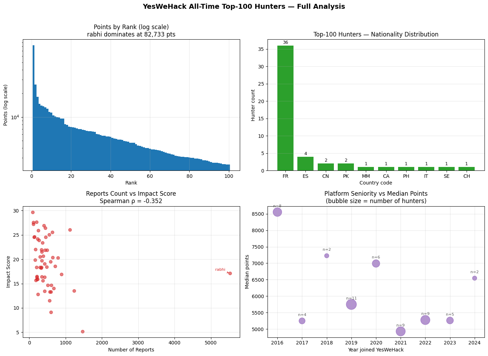

# YesWeHack Rankings: Data Collection & Analysis

> Data engineering and statistical analysis of the all-time top-100 bug bounty hunters on the [YesWeHack](https://yeswehack.com/ranking) platform. Completed as part of a technical assessment for an Application Security Analyst role.

**Author:** Narz Angelo Alcaide
**Date:** May 17, 2026
**Stack:** Python 3, `pandas`, `numpy`, `scipy`, `matplotlib`, `requests`

---

## TL;DR

I reverse-engineered YesWeHack's public ranking API via browser DevTools, built an ethical two-phase scraper, collected data on 100 hunters (56 enriched with profile data), and ran statistical tests to surface five non-obvious findings about the platform's competitive landscape.

**Highlights:**
- The leaderboard follows a **sub-Zipfian power law** (α = 0.63) – top-1 hunter alone holds **12.7%** of all points
- **French dominance is real but caveated** – 64% of public profiles are French, consistent with the platform's Paris origins
- **Quality vs. quantity** is a statistically significant split (Spearman ρ = -0.352, p = 0.008) – high-impact hunters have *fewer* reports, not more
- **Seniority does not predict ranking** – 2024 joiners are already competitive with the 2021 cohort
- **Public-profile status has no measurable effect on points** (Mann-Whitney U, p = 0.574) – the platform doesn't structurally reward self-promotion

Full write-up in [`docs/REPORT.md`](docs/REPORT.md).

---

## Project Structure

```
.
├── README.md                # You are here
├── requirements.txt         # Python dependencies
├── .gitignore
├── scripts/
│   ├── scraper_phase1.py    # Collect all-time top-100 rankings
│   ├── scraper_phase2.py    # Enrich each hunter with profile data
│   └── analyzer.py          # 5 statistical observations + visualization
└── docs/
    └── REPORT.md            # Full analysis report (methodology, findings, limitations)
```

---

## Methodology Overview

### 1. Endpoint discovery (no HTML scraping)
The YesWeHack rankings page is a JavaScript-rendered SPA, so scraping HTML would be brittle. Instead, I opened DevTools → Network → XHR filter and identified two underlying JSON APIs:

- `GET /ranking?page={n}` – paginated all-time leaderboard (25/page × 4 pages)
- `GET /hunters/{slug}` – individual public profile (nationality, impact, reports, join year)

### 2. Two-phase collection
- **Phase 1 – Rankings:** 4 requests, ~2 seconds total. 100 hunters collected.
- **Phase 2 – Profile enrichment:** 100 requests with 1.5s delay. 56/100 profiles retrieved successfully; ~14 were private (404, expected), ~30 were rate-limited (429). Exponential backoff with `Retry-After` would recover these in a subsequent run.

### 3. Ethical scraping
- Self-identifying `User-Agent: ywh-research-scraper/1.0 (technical-assessment)` – no browser impersonation
- Conservative inter-request delay (1.5s)
- Graceful handling of 404 (private) and 429 (rate-limited) responses
- `raise_for_status()` to fail loudly on unexpected errors

### 4. Statistical methods
- **Power-law fit** for points concentration (log-log regression, Gini coefficient)
- **Spearman correlation** for impact-vs-reports and seniority-vs-points (non-parametric, robust to outliers)
- **Mann-Whitney U** for public-vs-private comparison (non-parametric, robust to skew)

---

## Running the Scripts

### Requirements

```bash
pip install -r requirements.txt
```

### Phase 1: Collect rankings

```bash
python scripts/scraper_phase1.py
# Output: hunters_rankings.csv (100 rows)
```

### Phase 2: Enrich with profile data

```bash
python scripts/scraper_phase2.py
# Output: hunters_full.csv (100 rows, ~56 with profile fields)
```

### Analysis

```bash
python scripts/analyzer.py
# Prints all 5 observations to stdout
# Generates rankings_analysis.png (4-panel visualization)
```

> **Note on reproducibility:** YesWeHack's rankings change over time. Running these scripts later will produce different numerical results, but the methodology and analysis approach remain valid.

---

## Key Findings (Detail)

### 1. Points concentration follows a sub-Zipfian power law

| Segment | % of all points |
|---|---|
| Rank 1 only (rabhi) | **12.7%** |
| Top 10 | **33.5%** |
| Top 25 | **52.8%** |
| Top 50 | **74.8%** |

- Gini coefficient: **0.387** (moderate inequality)
- Rank-1 vs rank-2 gap: **3.16×**
- Power-law exponent α = 0.63 (sub-Zipfian; pure Zipf would be α ≈ 1.0)

Most concentration is driven by a single long-tenured outlier (rabhi, since 2016, 5,522 reports), not a steep elite gradient.

### 2. French dominance: but caveated

36 of 56 public profiles (64%) are French. The platform was founded in France in 2015. Note this is amplified by selection bias. French hunters may be more likely to have public profiles. The actual all-100 distribution is likely more international.

### 3. Quality vs. quantity: statistically significant

**Spearman ρ = -0.352, p = 0.008** between report count and impact score.

| Strategy | Example | Reports | Impact/Report |
|---|---|---|---|
| Volume | rabhi (rank 1) | 5,522 | 0.003 |
| Quality | Mekky (rank 92) | 91 | **0.326** |

Two distinct paths to the top-100. The "quality" hunters cluster in ranks 80–92. Elite by impact, not yet by total points.

### 4. Seniority is not destiny

Spearman ρ = -0.164, p = 0.226. **Not statistically significant.**
2024 joiners (mean 6,546 pts) are already competitive with the 2021 cohort (6,219 pts).

### 5. Public profile has no effect on points

Mann-Whitney U = 834, p = 0.574. **Not statistically significant.**
Profile visibility does not confer a measurable points advantage, a fairness-positive finding for the platform.

---

## Visualizations



| Panel | Description |
|---|---|
| **Top-left** | Points by rank on log scale: visual confirmation of the power-law shape and rabhi's outlier status |
| **Top-right** | Nationality distribution bar chart: French dominance immediately visible |
| **Bottom-left** | Impact score vs. report count scatter: negative correlation (ρ = -0.352) illustrates the quality/quantity split |
| **Bottom-right** | Platform seniority bubble chart: 2016 cohort inflated by rabhi; 2024 joiners already competitive |

---

## Limitations

- **56/100 profile coverage**: rate-limited and private profiles excluded from nationality/impact analyses
- **Single snapshot** (May 17, 2026): no time-series view of rank velocity
- **No report-level data**: severity, vulnerability type, and program details require authenticated API access
- **Self-reported nationality**: may not reflect actual location
- **Correlation ≠ causation**: observational analysis only

See [`docs/REPORT.md`](docs/REPORT.md) for full discussion.

---

## License

This project is for educational and portfolio purposes. The data was collected from publicly available endpoints on yeswehack.com in compliance with reasonable scraping ethics. No private or authenticated data was accessed.
